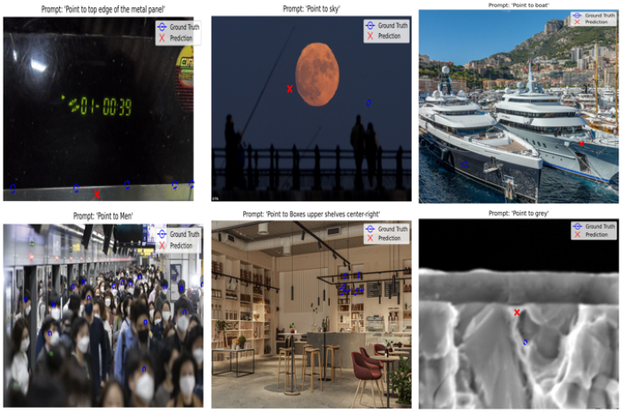

# Fine-Tuning a Vision-Language Model for Generative Visual Grounding

This repository contains the code and report for a project focused on fine-tuning Google's PaliGemma-2, a 3-billion parameter Vision-Language Model (VLM), for the task of visual grounding. The goal is to instruct the model with a text prompt (e.g., "Point to the cat") and have it generate the precise `(x, y)` coordinates of the object in the image.

This project reformulates a classic computer vision problem into a conditional text generation task, leveraging the power of modern generative AI. We employ a parameter-efficient fine-tuning (PEFT) technique called QLoRA to make training feasible on a single GPU.

**Final Report:** [Project Report (PDF)](./report/Kazybek_Askarbek.pdf)



---

## Table of Contents
1. [Project Overview](#project-overview)
2. [Features](#features)
3. [Installation](#installation)
4. [Usage](#usage)
    - [Jupyter Notebook (Recommended)](#jupyter-notebook-recommended)
    - [Finetuning Script](#finetuning-with-accelerate-script)
    - [Evaluation Script](#evaluation-script)

---

## Project Overview

This project demonstrates a complete workflow for fine-tuning a large VLM:
- **Data Processing:** Downloading, caching, and cleaning the `allenai/pixmo-points` dataset.
- **Model Preparation:** Setting up the PaliGemma-2 model with 4-bit quantization and LoRA adapters (QLoRA).
- **Efficient Training:** Using Hugging Face `transformers` and `accelerate` for efficient, distributed training.
- **Generative Task Formulation:** Instead of predicting bounding boxes via regression, the model is trained to generate a structured string like `<point x="0.51" y="0.48">boat</point>`.
- **Evaluation:** Implementing and running both qualitative (visual inspection) and quantitative (Object-based Pointing Accuracy) evaluations.

## Features
- **Model:** `google/paligemma2-3b-pt-224`
- **Dataset:** `allenai/pixmo-points`
- **Technique:** Quantized Low-Rank Adaptation (QLoRA) for memory-efficient fine-tuning.
- **Frameworks:** PyTorch, Hugging Face (`transformers`, `datasets`, `peft`, `accelerate`), Pixi.

---

## Installation

This project uses [Pixi](https://pixi.sh/) for dependency management to ensure a reproducible environment.

### 1. Install Pixi
Follow the instructions on the [official Pixi website](https://pixi.sh/latest/).

### 2. Clone the Repository
```bash
git clone https://github.com/QazyBi/point-vlm.git
cd point-vlm
```

### 3. Install Dependencies
Pixi will automatically create a virtual environment and install all required packages from the `pixi.lock` file.
```bash
pixi install
```
> **Note:** This command sets up everything you need, including the correct PyTorch and CUDA versions.

---

## Usage

Before running any script, make sure your Hugging Face token is available as an environment variable. This is required to download the PaliGemma-2 model.

```bash
export HF_TOKEN="your_huggingface_token_here"
```

### Jupyter Notebook (Recommended)

For a step-by-step walkthrough with detailed explanations and visualizations, use the Jupyter Notebook:

1. **Start the Jupyter server within the Pixi environment:**
    ```bash
    pixi run jupyter notebook
    ```
2. In the Jupyter interface, navigate to the `notebooks/` directory and open `finetune_paligemma2.ipynb`.
3. Run the cells in order to see the data preparation, training, and evaluation process.

### Finetuning with Accelerate Script

To run the full training pipeline via script:

```bash
pixi run python scripts/finetune_paligemma2.py
```

- The script will handle data preparation and save the final model adapters and processor to the `output/` directory by default.

### Evaluation Script

After training, you can run quantitative evaluation on the validation set:

```bash
pixi run python scripts/run_evaluation.py
```

- This will load the fine-tuned model from the specified directory and print the final Precision, Recall, and F1-Score.

---

## Tips & Best Practices
- For best results, use a machine with a modern GPU and sufficient VRAM (at least 24GB recommended for 3B models).
- If you encounter CUDA or dependency issues, ensure your drivers and CUDA toolkit are up to date.
- For custom experiments, modify the scripts in the `scripts/` directory or use the notebook for interactive exploration.

---

## License

This project is for research and educational purposes. See the repository for license details.
